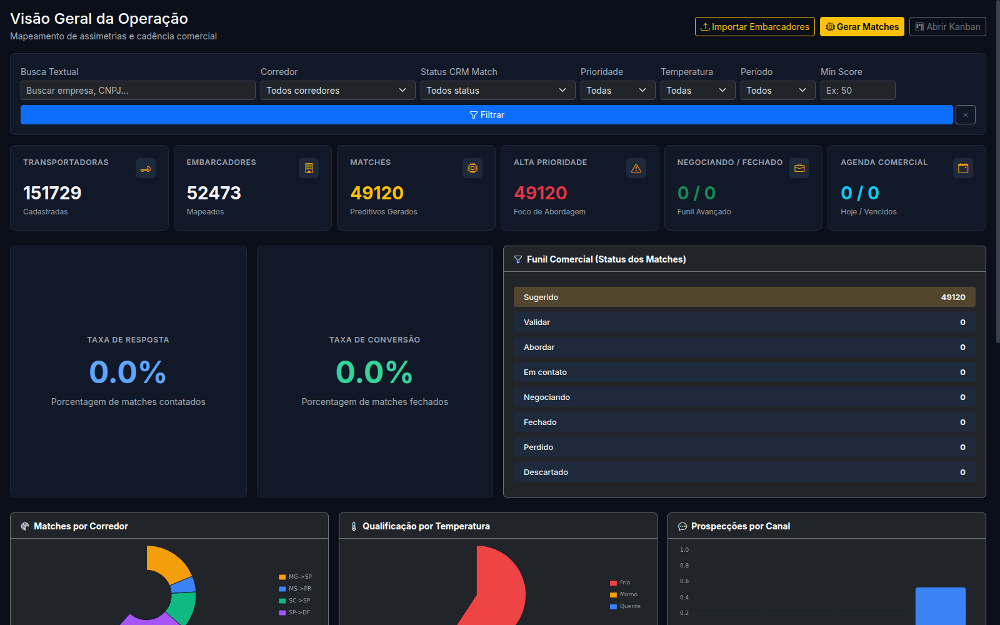
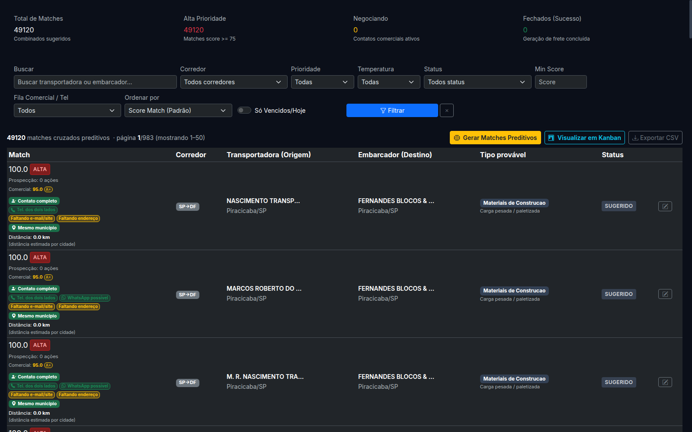
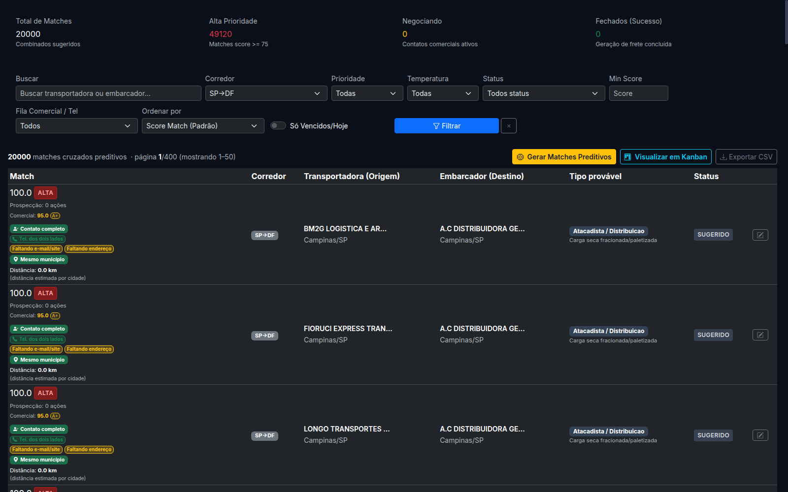
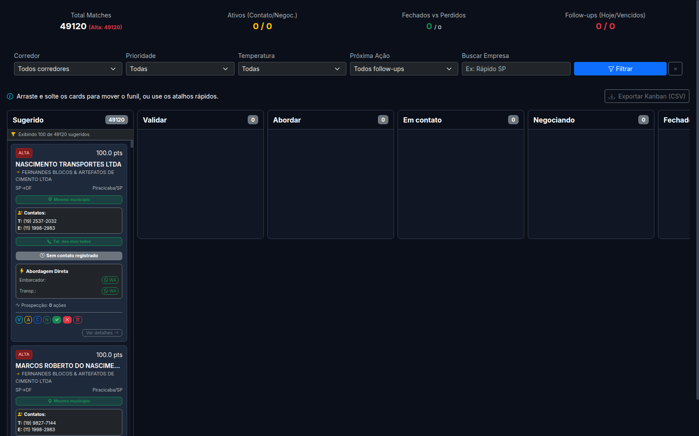
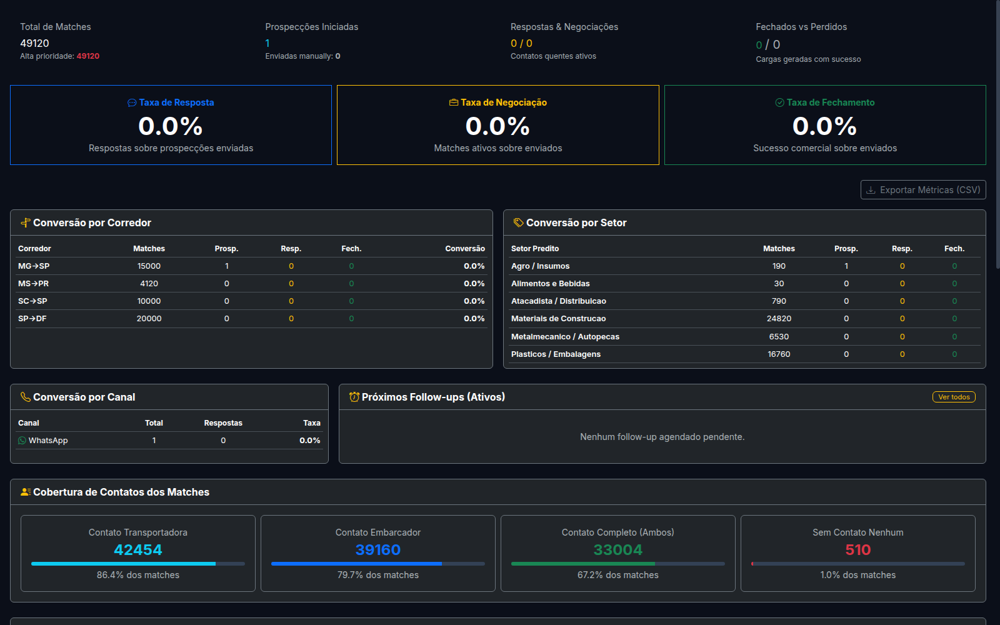

# Manual de Uso — WiNS Hub Log

Este manual foi desenvolvido para guiar operadores comerciais e operacionais no uso do sistema **WiNS Hub Log** de forma prática, passo a passo e sem necessidade de conhecimento técnico em programação.

---

## 1. O que é o WiNS Hub Log

O **WiNS Hub Log** é uma ferramenta de inteligência de dados logística projetada para combater a ineficiência de caminhões retornando vazios (capacidade ociosa) nas estradas brasileiras.

* **Cruzamento de Dados:** A ferramenta analisa dados de transportadoras (oferta de caminhões) e de embarcadores (demanda de cargas) para sugerir as melhores combinações por corredor logístico.
* **Mapeamento Preditivo:** Ao identificar assimetrias geográficas e operacionais, o sistema gera "matches" preditivos.
* **Segurança e Operação Manual:** **A ferramenta NÃO dispara e-mails, SMS, WhatsApp ou chamadas telefônicas de forma automatizada.** Todas as ações de contato e validação comercial devem ser feitas manualmente pelo operador do sistema.

---

## 2. Conceitos Principais

### Match
Uma combinação lógica entre uma transportadora e um embarcador provável que têm afinidade de rotas, setores e carrocerias.

### Score Match
O indicador de compatibilidade logística original (calculado de 0 a 100). É o ranking estatístico principal gerado pelas heurísticas preditivas da ferramenta.

### Score Comercial
Pontuação (de 0 a 100) que prioriza a abordagem de prospecção. Esse score pondera o `score_match` original, a disponibilidade de contatos telefônicos nas duas pontas, flags de WhatsApp provável, distância geográfica e completude de dados.

### Completude
Índice percentual que reflete a qualidade e a quantidade de dados cadastrais disponíveis para uma empresa no sistema (como CNPJ, endereço completo, dados societários/QSA e telefone).

### Geografia
A distância estimada em quilômetros (`distancia_km`) entre o endereço ou centroide da cidade da transportadora e a localização do embarcador. 
> [!IMPORTANT]
> **Nota Geográfica:** A maioria dos registros possui precisão estimada em nível de **cidade (centroide municipal)**. Trata-se de um indicador estatístico auxiliar de proximidade, não devendo ser tratado como endereço físico absoluto.

### Match Acionável
Um match que possui pelo menos uma informação de contato válida (telefone, e-mail, site ou sócios) em qualquer uma das duas pontas para permitir o início da abordagem.

### Telefone dos Dois Lados
Indica que tanto a transportadora quanto o embarcador possuem pelo menos um número de telefone cadastrado no sistema.

### WhatsApp Possível
Classificação atribuída automaticamente a números de telefone celular estruturados que são elegíveis para o envio de mensagens no aplicativo WhatsApp. **Não significa WhatsApp ativo ou confirmado.**

---

## 3. Como Acessar a Ferramenta

1. Abra o seu navegador web (Chrome, Firefox, Safari ou Edge).
2. Acesse a URL: **http://127.0.0.1:5055**
3. Caso esteja acessando a ferramenta de forma remota através de um túnel SSH (redirecionamento de porta), **mantenha o seu terminal de comando aberto**. Caso o terminal seja fechado, a conexão será recusada.

### Comandos Úteis de Manutenção (Servidor):
Caso precise verificar o status ou reiniciar a aplicação no terminal da VPS:
```bash
# Verificar se a aplicação está ativa e operando
sudo systemctl status wins-hub-log --no-pager

# Reiniciar o serviço (caso ocorra lentidão ou travamento)
sudo systemctl restart wins-hub-log
```

---

## 4. Dashboard Inicial (Visão Geral)

O painel inicial apresenta um diagnóstico rápido da base comercial e estatísticas de contatos.



### O que monitorar:
* **KPIs Principais:** Total de transportadoras, embarcadores e matches ativos no sistema.
* **Matches por Corredor:** Gráfico de distribuição do volume nos corredores oficiais.
* **Conversão por Temperatura:** Volume de negociações classificadas como *Quente*, *Morno* ou *Frio*.

### Passo a Passo — Filtrar por Corredor:
1. Localize a barra de **Filtros Globais** no topo da página.
2. Na opção **Corredor**, selecione o corredor de interesse (ex: `SP->DF`).
3. Clique em **Filtrar**.
4. Você será automaticamente redirecionado para a tela `/matches` com os resultados filtrados.

---

## 5. Tela de Matches

Esta tela concentra a listagem detalhada de todas as combinações sugeridas pela ferramenta.



### Estrutura de Exibição:
* **Coluna de Dados Principais (Esquerda):** Transportadora e Embarcador associados, incluindo e-mail, telefone normalizado e as badges de status.
* **Score & Prioridade:** Apresenta o Score do Match (compatibilidade) e o Score Comercial ao lado da classificação.
* **Ações Operacionais:** O botão com ícone de lápis (`Editar CRM`) abre o painel lateral de acompanhamento comercial (*offcanvas*).

### Passo a Passo — Acompanhamento Comercial:
1. Na linha do match escolhido, clique no botão de **lápis (Editar)** no canto direito.
2. O painel lateral abrirá exibindo o histórico de prospecções.
3. No painel, você verá telefones normalizados e nomes dos sócios/administradores (se disponíveis).
4. Realize o contato manual via ligação ou WhatsApp.
5. Após o contato, altere o **Status Comercial do Match** no formulário do painel lateral.
6. Registre observações sobre a negociação no campo de texto e clique em **Salvar Negociação**.

---

## 6. Filtros de Matches

A barra de filtros de `/matches` permite segmentar a base em tempo real para encontrar as oportunidades operacionais ideais.



### Filtros Disponíveis:
* **Buscar:** Campo para busca textual rápida por Razão Social, CNPJ ou Nome Fantasia.
* **Corredor:** Segmenta por rota (ex: `SP->DF`, `MG->SP`, `SC->SP`, `MS->PR`).
* **Status CRM:** Filtra pelo andamento no funil comercial (`Sugerido`, `Em contato`, `Negociando`, etc.).
* **Fila Comercial / Tel (Novo):** Permite selecionar subfilas inteligentes como:
  * *Fila A — Piloto Ideal:* Matches prontos para abordagem (altíssimo score, telefone nas duas pontas e WhatsApp possível).
  * *Classe Comercial A+:* Apenas os matches com prioridade comercial calculada `>= 90`.
* **Ordenar por (Novo):** Alternar entre ordenação por *Score Match (Padrão)* ou *Prioridade Comercial* (para colocar as empresas com melhores contatos no topo).

---

## 7. Entendendo os Badges (Etiquetas Visuais)

Os badges ajudam a tomar decisões rápidas sem abrir os detalhes cadastrais da empresa.

### 📞 Cobertura de Contatos e Telefones
* **Contato completo**: Transportadora e embarcador possuem telefones e e-mails/dados cadastrais.
* **Tel. dos dois lados**: Ambas as pontas possuem pelo menos um telefone.
* **Sem telefone**: Nenhuma das partes possui número de telefone.
* **WhatsApp possível**: Pelo menos um dos números é celular brasileiro válido.

### 📊 Completude de Dados
* **Dados completos**: Transportadora e embarcador atingiram 100% de preenchimento.
* **Faltando endereço**: Dados de CEP ou logradouros estão incompletos.
* **Faltando QSA**: Dados de sócios ou administradores não foram identificados.

### 📍 Geografia Auxiliar
* **Mesmo município**: Transportadora e embarcador estão na mesma cidade.
* **Próximo (até 30 km)**: Empresas a curtíssima distância logística.
* **Médio (30 a 150 km)**: Distância operacional padrão.
* **Distante (> 150 km)**: Grande distância geográfica.

---

## 8. Kanban (Funil Comercial)

A tela de Kanban fornece uma visão dinâmica e visual das negociações.



* **Organização em Colunas:** Cada cartão representa um match.
* **Arraste Manual:** Mova os cartões lateralmente apenas após realizar uma ação comercial concreta de contato ou negociação com as empresas.
* **Canais Rápidos:** Os ícones dentro dos cartões permitem consultar contatos telefônicos de forma rápida.

---

## 9. Métricas Operacionais

Concentra os relatórios analíticos de BI da operação de fretes.



### O que analisar:
* **Qualidade Logística dos Matches:** Distribuição geográfica (proporção de matches no mesmo município ou distantes).
* **Qualidade de Contatos:** Taxa de cobertura de telefones e e-mails de transportadoras e embarcadores de forma independente.

---

## 10. Fila Comercial Inteligente

Esta funcionalidade prioriza os melhores matches da base de dados sem interagir com as empresas.
Os arquivos estruturados estão disponíveis no servidor na pasta: `exports/comercial/`

* **`fila_piloto_A_plus.csv`**: Matches com melhor score geográfico e com WhatsApp possível.
* **`fila_telefone_dois_lados.csv`**: Lista de prioridade com telefones confirmados.
* **`fila_completar_dados_antes.csv`**: Empresas com matches promissores, mas que necessitam de enriquecimento de dados cadastrais antes da abordagem.

---

## 11. Operação Piloto 100 SP->DF

O corredor **SP->DF** foi qualificado como o mais maduro para uma operação controlada. A lista piloto manual contém 100 matches qualificados.

Os arquivos de apoio estão em: `exports/pilotos/`
* **`piloto_100_sp_df.csv`**: Lista oficial ordenada dos 100 matches ideais.
* **`controle_manual_piloto_100_sp_df.csv`**: Planilha de preenchimento manual do operador.
* **`ROTEIRO_ABORDAGEM_PILOTO_100_SP_DF.md`**: Guia de diálogos para contato.

### Passo a Passo Operacional:
1. Abra o arquivo `controle_manual_piloto_100_sp_df.csv`.
2. Selecione os 20 primeiros registros da lista.
3. Realize o contato com a transportadora correspondente seguindo o roteiro.
4. Anote a resposta e preencha as colunas correspondentes de forma manual.
5. Se a transportadora demonstrar interesse operacional firme, prossiga para a validação com o embarcador correspondente.

---

## 12. Roteiro de Abordagem Manual

### 1. Mensagem Inicial para Transportadora (WhatsApp/Telefone):
> *"Olá, tudo bem? Meu nome é [Seu Nome], da WiNS Hub Log. Estamos validando oportunidades de rotas e frete de retorno no corredor SP→DF. Vocês costumam atender esse trecho ou têm interesse em posicionar caminhões nessa rota?"*

### 2. Se responder SIM:
> *"Excelente! Nosso objetivo é validar se vocês operam com carga seca e paletizada nesse sentido e se possuem preferência por alguma região específica de carregamento no estado de São Paulo. Qual o tipo de carroceria que vocês rodam mais nessa linha?"*

### 3. Se responder NÃO:
> *"Tudo bem, agradeço o retorno. Vou registrar em nosso cadastro para não incomodarmos vocês com propostas nessa rota no futuro."*

---

## 13. Regras de Segurança e Boas Práticas

> [!WARNING]
> **Cuidados Importantes:**
> 1. **Não faça disparos em massa:** O contato massivo bloqueia os números comerciais da empresa.
> 2. **Não prometa carga:** Nunca diga à transportadora que existe uma carga fechada e garantida para ela antes de contatar o embarcador.
> 3. **Não prometa tarifa/frete:** Evite dar estimativas de preços de frete sem validar as condições comerciais com o embarcador.
> 4. **Não sugira contratos inexistentes:** Não afirme que o WiNS Hub Log possui exclusividade sobre as demandas das empresas mapeadas.
> 5. **Valide a geografia:** Lembre-se de que a distância informada é calculada por centroides de municípios e deve ser refinada com os endereços de carregamento.

---

## 14. Fluxo Operacional Recomendado

1. **Iniciar o Dia:** Acesse a tela de Métricas e selecione o Corredor Alvo.
2. **Identificar Oportunidades:** Ir para a tela de Matches, filtrar por Fila Piloto Ideal ou Classe A+.
3. **Selecionar Empresa:** Escolher matches que possuam telefone dos dois lados e sinal de WhatsApp possível.
4. **Contatar Transportadora:** Abordar a transportadora de forma manual usando o roteiro de abordagem.
5. **Se houver interesse:** Prosseguir para o contato com o embarcador associado para apresentar a transportadora qualificada.
6. **Se não houver interesse:** Marcar o status do match como "Sem Interesse" e registrar notas do motivo.
7. **Atualizar Sistema:** Mover o cartão na tela de Kanban e registrar observações e data de follow-up.

---

## 15. Manutenção Básica

O operador deve validar o banco de dados rodando os scripts de auditoria integrados periodicamente:
```bash
# Executar auditoria de telefones
python scripts/auditar_telefones_matches.py

# Executar auditoria de completude
python scripts/auditar_completude_dados.py

# Realizar backup de segurança do banco
python scripts/backup_db.py
```

---

## 16. Problemas Comuns e Como Resolver

| Problema | Causa Provável | Como Resolver |
| :--- | :--- | :--- |
| **Página não abre** | O serviço do app Flask/Gunicorn caiu no servidor. | Acesse o terminal da VPS e execute `sudo systemctl restart wins-hub-log`. |
| **Erro: Conexão Recusada** | Túnel SSH fechado ou porta bloqueada no firewall. | Verifique se o seu terminal SSH com o redirecionamento de porta local está ativo. |
| **Filtros de matches lentos** | Alta concorrência de queries no banco SQLite. | Evite rodar scripts pesados de importação durante o horário de prospecção comercial. |
| **Match sem telefone** | Dados cadastrais incompletos na Receita/BrasilAPI. | Realize busca manual pelo CNPJ da empresa em mecanismos de busca públicos e cadastre no CRM. |
| **Distância igual a 0 km** | Ambas as empresas estão cadastradas na mesma cidade. | Válido, mas lembre-se de confirmar o endereço real das instalações físicas de carregamento. |

---

## 17. Glossário

* **Embarcador:** A empresa industrial, comercial ou do agronegócio que possui a mercadoria a ser transportada.
* **Transportadora:** A empresa prestadora de serviços de logística rodoviária que oferta frota de caminhões.
* **Corredor:** A rota logística de origem e destino definida (ex: SP->DF representa caminhões saindo de São Paulo com destino ao Distrito Federal).
* **Funil Comercial:** O fluxo de estados operacionais de um match, dividido em colunas no Kanban.

---

## 18. Checklist Diário do Operador

### Antes de iniciar os contatos:
- [ ] O app está abrindo corretamente na rota `/matches`?
- [ ] A planilha de controle manual do piloto está baixada e acessível?
- [ ] O WhatsApp Business comercial da operação está ativo e conectado?

### Durante a operação:
- [ ] Fazer abordagens estritamente manuais e personalizadas.
- [ ] Anotar os nomes dos interlocutores, telefones validados e restrições operacionais.
- [ ] Preencher o status de resposta na planilha de controle imediatamente.

### Ao final do dia:
- [ ] Atualizar os cartões correspondentes na tela de `/kanban`.
- [ ] Compartilhar com o coordenador as transportadoras que demonstraram interesse firme.
